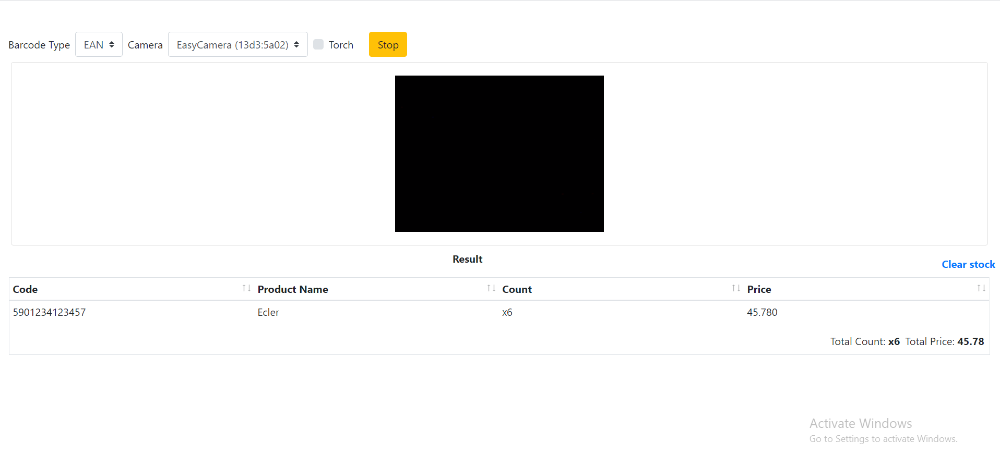

The [barcode_reader](https://github.com/jsgrowing315/vue-barcode-reader.git) 
is source code which read ean barcode from webcamera and add this product to database

### source written vue.js.
there are sample ean-13 barcode image on image folder.

    

